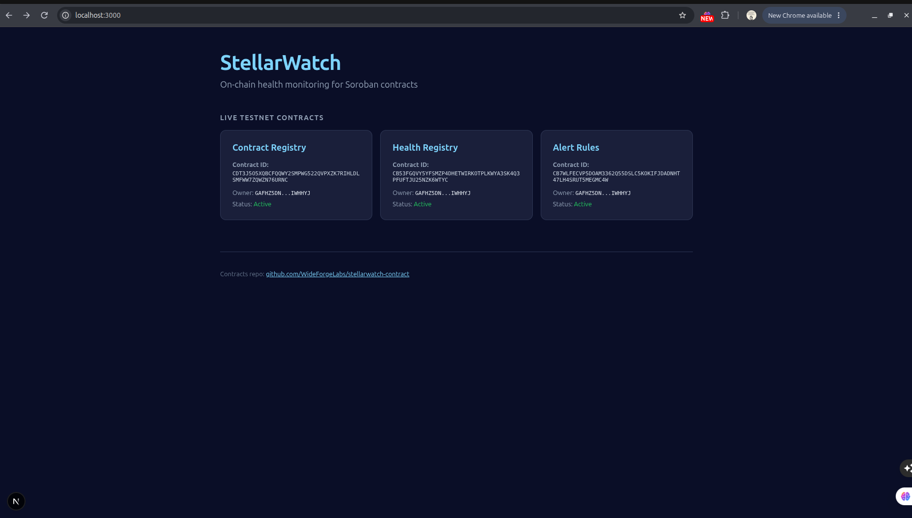

# StellarWatch App

Dashboard, SDK, and indexer for StellarWatch — on-chain health monitoring for Soroban contracts.

## What This Is

The application layer for StellarWatch. It reads from the on-chain contracts in [stellarwatch-contract](https://github.com/WideForgeLabs/stellarwatch-contract) and surfaces health data through a web dashboard.

**Live demo:** https://stellarwatch-app-web.vercel.app

## Components

- **packages/sdk** — TypeScript client wrappers for the StellarWatch contracts
- **apps/web** — Next.js dashboard for viewing health status and managing alerts
- **services/indexer** — Event listener that stores health history and dispatches alerts
- **docs** — SDK reference and API documentation

## Status

Working proof-of-concept. The dashboard reads live data from all three testnet contracts and is deployed on Vercel.

See [open issues](https://github.com/WideForgeLabs/stellarwatch-app/issues) for work available to contributors.

## Related Repositories

- [stellarwatch-contract](https://github.com/WideForgeLabs/stellarwatch-contract) — Soroban smart contracts

## Maintainers

| Name | Role | Contact |
|------|------|---------|
| [@Ikechukwu-Patrick](https://github.com/Ikechukwu-Patrick) | Lead maintainer | [Telegram: @IkSunshine](https://t.me/IkSunshine) |
| [@martinifeanyi058-ship-it](https://github.com/martinifeanyi058-ship-it) | SDK engineer | [Telegram: @threalxavier](https://t.me/threalxavier) |

## Community

Join the StellarForge Developers Telegram group: [t.me/StellarForgeDevCodes](https://t.me/StellarForgeDevCodes)

## License

MIT
